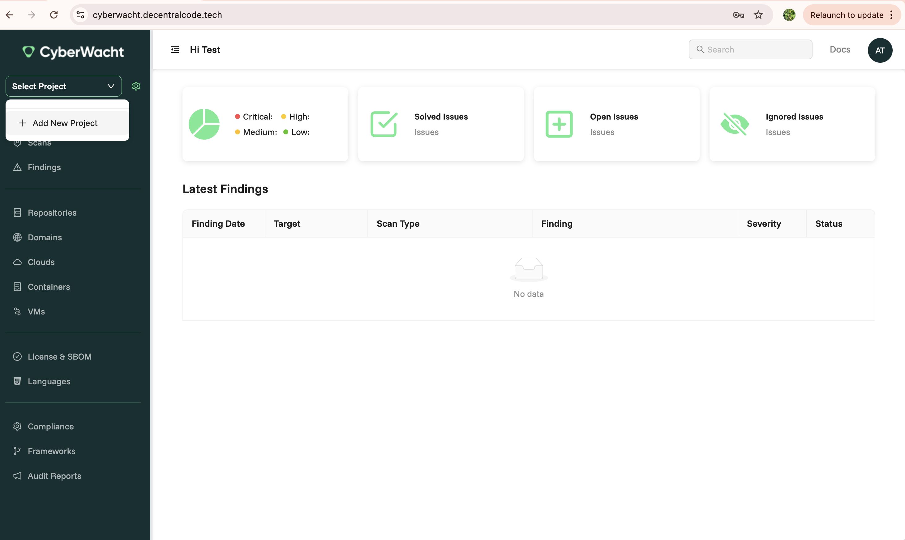

## Add a New Project

To add a new project, follow these steps:

- **Click the "Add New Project" Button:**

  - On the Projects page, click the dropdown in the top left corner.
  - Select the **"Add New Project"** button to initiate the project creation process.

- **Provide Project Details:**

  - A modal window will appear where you need to provide the following information:

    - **Project Name:** Enter a descriptive name for your project.
    - **Project Description:** Add an optional description to provide context about the project.

**Step 1**

{: .centered-image1 }

**Step 2**

{: .centered-image1 }
